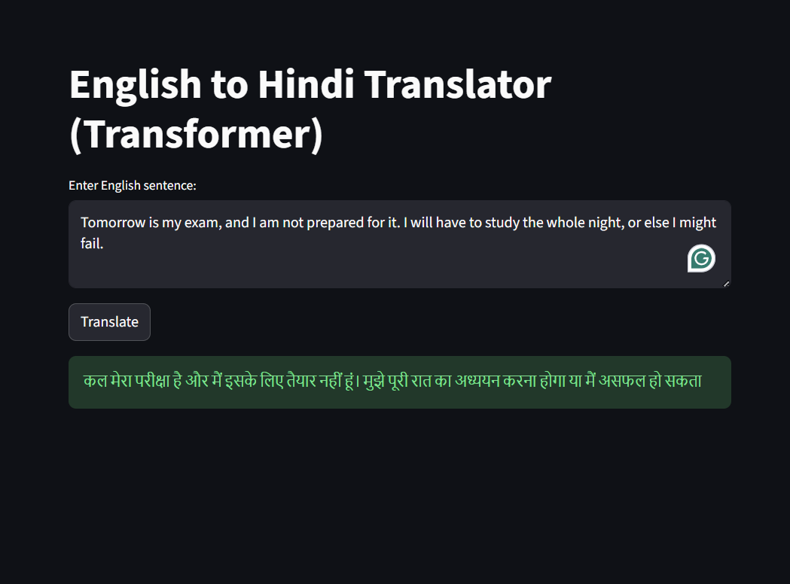

# 🌍 English → Hindi Neural Machine Translation (Transformer)

A deep learning-based Neural Machine Translation (NMT) system that translates English sentences into Hindi using a Transformer architecture. This project demonstrates modern NLP techniques including subword tokenization, sequence-to-sequence learning, and attention mechanisms.

---
### 🔹 Translation Example

---

## 🚀 Live Demo

👉 **Try the app here:**
🔗 *https://nmt-english-to-hindi.streamlit.app/*

You can enter any English sentence and get a Hindi translation instantly.

---

## 🧠 Project Overview

This project builds a complete NMT pipeline:

* English -> Hindi translation
* Transformer-based encoder-decoder architecture
* Subword tokenization using SentencePiece
* Beam search decoding for improved translation quality
* Evaluation using BLEU score

---

## 🏗️ Architecture

The model is based on the Transformer introduced in
**“Attention Is All You Need” (2017)**.

Key components:

* Positional Encoding
* Multi-Head Self Attention
* Encoder–Decoder Architecture
* Masked Attention for sequence generation

---

## 📊 Dataset

* IIT Bombay English-Hindi Parallel Corpus
* Contains aligned sentence pairs for supervised translation

---

## 🔤 Tokenization

We use **SentencePiece (Unigram model)** for subword tokenization:

* Vocabulary size: 10,000
* Handles rare words and morphology effectively
* Reduces out-of-vocabulary (OOV) issues

---

## ⚙️ Model Configuration

| Parameter                | Value  |
| ------------------------ | ------ |
| Embedding Size (d_model) | 256    |
| Heads                    | 8      |
| Encoder Layers           | 3      |
| Decoder Layers           | 3      |
| Dropout                  | 0.2    |
| Max Sequence Length      | 25     |
| Vocabulary Size          | 10,000 |

---

## 🧪 Training Details

* Optimizer: Adam (β₁=0.9, β₂=0.98)
* Learning Rate Scheduler: Transformer Warmup
* Gradient Clipping: 1.0
* Label Smoothing: experimented (0.1 -> 0)
* Epochs: 15+

---

## 📈 Evaluation

Evaluation is performed using BLEU score.

| Model                     | BLEU |
| ------------------------- | ---- |
| Transformer (Greedy)      | ~22  |
| Transformer (Beam Search) | ~25+ |

---

## 🔍 Features

* ✅ End-to-end NMT pipeline
* ✅ Subword tokenization (SentencePiece)
* ✅ Transformer architecture (PyTorch)
* ✅ Beam search decoding
* ✅ Streamlit web interface
* ✅ BLEU score evaluation

---

## 💻 Installation & Setup

```bash
git clone https://github.com/Hrishikesh-Gaikwad-GG/NMT-English-to-Hindi.git
cd NMT-English-to-Hindi

pip install -r requirements.txt
```

---

## ▶️ Run Locally

```bash
streamlit run app.py
```

---

## 📁 Project Structure

```text
.repo-root/
│
├── notebook.ipynb # Training & experimentation
├── models/
│ ├── best_model.pth 
│ ├── spm_en.model 
│ └── spm_hi.model 
|── app.py 
├── model.py
├── requirements.txt
├── screenshots/
│ └── translation.png
└── README.md

```

---

## 📌 Future Improvements

* Add attention visualization
* Support multilingual translation
* Improve BLEU with larger Transformer
* Deploy API (FastAPI / Flask)
* Add voice input/output

---

## 🙌 Acknowledgements

* IIT Bombay for dataset
* PyTorch for deep learning framework
* SentencePiece for tokenization


---

⭐ **If you like this project, consider giving it a star!**
